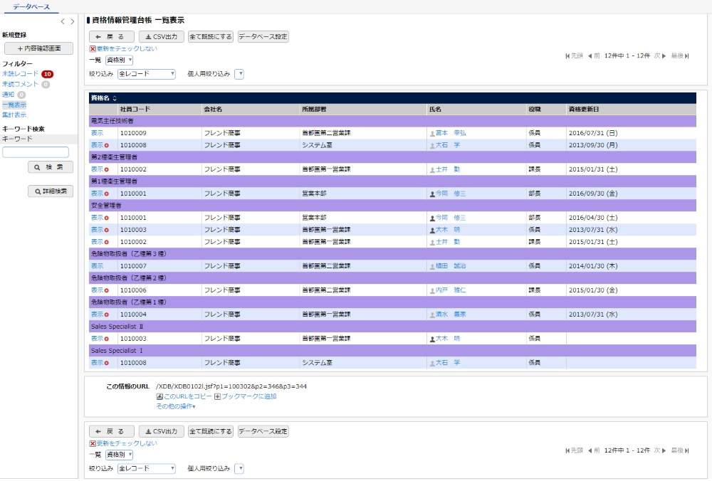

# サーバー台帳 - Server Inventory Management System

モダンでスケーラブルなサーバー資産管理Webアプリケーション



## 概要

企業のサーバー資産を一元管理するための Web アプリケーションです。メタデータ駆動型の設計により、新しいフィールドの追加や変更を柔軟に行うことができます。

### 主な機能

✅ **サーバー一覧表示** - 検索、フィルタリング、ソート機能付き  
✅ **詳細ドロワー** - 右側パネルでサーバー詳細を表示  
✅ **メタデータ駆動** - データ辞書による動的フィールド管理  
✅ **メトリクス管理** - サーバーの使用状況をリアルタイム表示  
✅ **監査ログ** - すべての変更を記録  
✅ **認証・認可** - JWT ベースの認証

## 技術スタック

| カテゴリ | 技術 |
|---------|------|
| **フロントエンド** | Next.js 15, TypeScript, Tailwind CSS, SWR |
| **バックエンド** | NestJS, TypeScript, Prisma ORM, Passport JWT |
| **データベース** | PostgreSQL 14+ (JSONB, マテリアライズドビュー) |

## クイックスタート

### 必要な環境

- Node.js 18+
- PostgreSQL 14+

### セットアップ

1. **データベースを作成**
```bash
createdb server_inventory
```

2. **バックエンドをセットアップ**
```bash
cd backend
npm install
cp .env.example .env
# .env を編集してデータベース接続情報を設定
npm run prisma:generate
npm run prisma:migrate
npx ts-node prisma/seed.ts  # サンプルデータ投入
npm run start:dev
```

3. **フロントエンドをセットアップ**
```bash
cd frontend
npm install
cp .env.example .env.local
npm run dev
```

4. **アクセス**
- フロントエンド: http://localhost:3000
- バックエンド API: http://localhost:3001

## ディレクトリ構造

```
TestRepo7/
├── frontend/          # Next.js アプリケーション
├── backend/           # NestJS API サーバー
├── database/          # データベーススキーマ
├── docs/             # 詳細ドキュメント
└── img_01.jpg        # UIデザイン参考資料
```

## 詳細ドキュメント

より詳しい情報は [docs/README.md](docs/README.md) を参照してください。

## ライセンス

MIT

